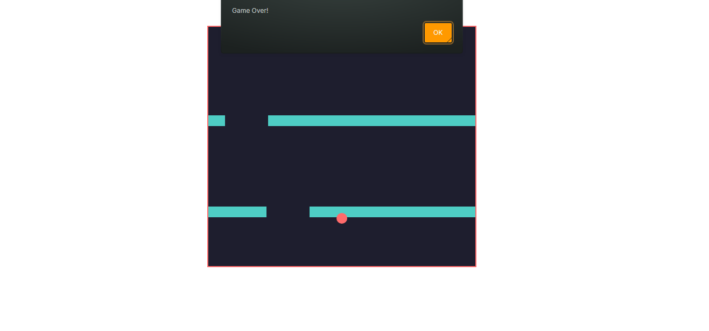

# 🏀 Falling Ball Game

A fun and interactive **Falling Ball Game** where the player must navigate a ball left and right to avoid obstacles while passing through gaps. The game increases in difficulty as obstacles fall faster over time.

---

## 🌟 Game Preview

| Game Start                                  | Game Over Screen                         |
|----------------------------------------------|-----------------------------------------|
|  |  |

---

## 💻 Tech Stack

This project is built using the following technologies:


---

## 🚀 How to Play

Follow these steps to play the **Falling Ball Game**:

1. **Clone the repository:**
   ```bash
   git clone https://github.com/Rochdi7/falling-ball.git
   ```

2. **Navigate to the project directory:**
   ```bash
   cd falling-ball
   ```

3. **Open `index.html` in your favorite browser** to start playing.

4. **Controls:**
   - Move **Left:** `← Arrow Key`
   - Move **Right:** `→ Arrow Key`
   - Avoid obstacles and pass through gaps to survive.

---

## 🎮 Features

- **Neon Cyber-Themed UI:**  
  A stylish, futuristic design with smooth animations.
- **Dynamic Obstacles:**  
  Blocks fall at intervals, and gaps allow safe passage.
- **Smooth Ball Movement:**  
  Left and right movement is optimized for smooth gameplay.
- **Collision Detection:**  
  If the ball hits an obstacle, the game is over.
- **Automatic Difficulty Increase:**  
  The obstacles move faster as time progresses.

---

## ✨ Future Improvements

We plan to enhance the game by adding:

- **Score Counter:**  
  Track how long you survive and compare with others.
- **Sound Effects:**  
  Add background music and collision sounds.
- **Mobile Support:**  
  Implement touch controls for a better mobile experience.
- **Leaderboard:**  
  Store high scores locally or in a database.
- **Power-ups:**  
  Add special items like shields or speed boosts.

---

## 🤝 Contributing

Contributions are always welcome! If you’d like to improve this project, follow these steps:

1. **Fork the repository.**
2. **Create a new branch** for your feature or bug fix:
   ```bash
   git checkout -b feature/your-feature-name
   ```
3. **Commit your changes**:
   ```bash
   git commit -m "Add some feature"
   ```
4. **Push to your branch**:
   ```bash
   git push origin feature/your-feature-name
   ```
5. **Open a pull request** on GitHub.

---

## 📜 License

This project is licensed under the **MIT License** - see the [LICENSE](LICENSE) file for details.

---

## 📬 Contact

For any inquiries or feedback, feel free to reach out:

- **Email:** rochdi.karouali1234@gmail.com
- **GitHub:** [@Rochdi7](https://github.com/Rochdi7)

---

## ⭐ Support

If you enjoy this project, please give it a star on GitHub! Your support helps improve and expand this game. Happy gaming! 🚀

---

Enjoy playing **Falling Ball Game!** 🎮🔥
