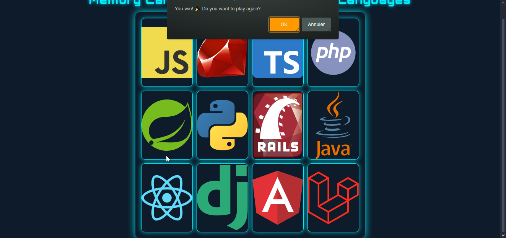

# 🃏 Memory Card Game for Programming Languages

A fun and interactive **Memory Card Game** designed to help users match **programming languages** with their respective **frameworks**. This project features a sleek **neon cyberpunk theme**, smooth animations, and an intuitive flipping mechanism.

---

## 🌟 Default View

Below are some screenshots of the **Memory Card Game** in action:

| Cards Before                                | Cards After Flip (Winning State)                         |
|----------------------------------------------|------------------------------------------------|
|  |  |

---

## 💻 Tech Stack

This project is built using the following technologies:


---

## 🚀 How to Play

Follow the steps below to play the **Memory Card Game**:

1. **Clone the repository:**
   ```bash
   git clone https://github.com/Rochdi7/Web-Mini-Projects/memory-card-game.git
   ```

2. **Navigate to the project directory:**
   ```bash
   cd memory-card-game
   ```

3. **Open `index.html` in your favorite browser** to start playing.

---

## 📜 Features

- **Cyberpunk Neon Design:**  
  Stunning glowing effects with futuristic animations.
- **Matching Logic:**  
  Flip two cards at a time and match programming languages with frameworks.
- **Smooth Flip Animation:**  
  Cards flip smoothly with a clean 3D effect.
- **Responsive Layout:**  
  Looks great on both desktop and mobile devices.
- **Dynamic Shuffling:**  
  The cards shuffle every time you refresh the game.
- **Win Alert:**  
  A pop-up appears when you successfully match all cards.

---

## ✨ Future Improvements

You can enhance this project further by adding:

- **Sound Effects:**  
  Add sound when flipping cards or winning the game.
- **Timer & Score Tracking:**  
  Implement a timer and scoring system to make the game more challenging.
- **Leaderboard:**  
  Save best times and scores locally or in a database.
- **Multiplayer Mode:**  
  Play against a friend with alternating turns.

---

## 🤝 Contributing

Contributions are always welcome! If you’d like to improve this project, follow these steps:

1. **Fork the repository.**
2. **Create a new branch** for your feature or bug fix:
   ```bash
   git checkout -b feature/your-feature-name
   ```
3. **Commit your changes**:
   ```bash
   git commit -m "Add some feature"
   ```
4. **Push to your branch**:
   ```bash
   git push origin feature/your-feature-name
   ```
5. **Open a pull request** on GitHub.

---

## 📢 License

This project is licensed under the **MIT License** - see the [LICENSE](LICENSE) file for details.

---

## 📬 Contact

For any inquiries or feedback, feel free to reach out:

- **Email:** rochdi.karouali1234@gmail.com
- **GitHub:** [@Rochdi7](https://github.com/Rochdi7)

---

## ⭐ Support

If you enjoy this project, please give it a star on GitHub! Your support inspires me to create more awesome projects. Happy coding! 🚀

---

Enjoy your Memory Card Game! 🎮🔥
